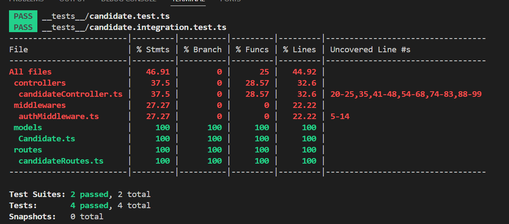
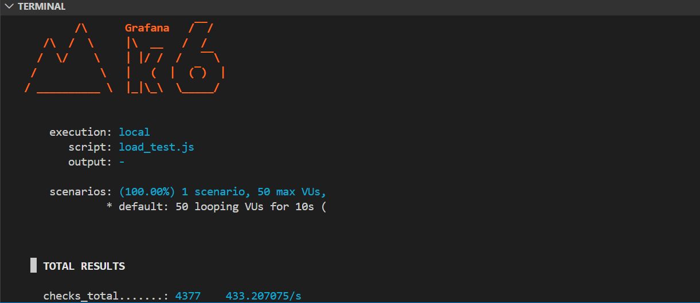

#  Full Stack & Test Engineer - Candidate Manager

Ce projet est une application de gestion de candidats développée en **24 heures**. L'objectif est de démontrer une maîtrise du développement Full Stack associée à une stratégie de tests exhaustive et une qualité de code irréprochable.

---

##  Stack Technique
- **Backend**: Node.js, Express, TypeScript, MongoDB (Mongoose).
- **Frontend**: React, TypeScript, Vite, React-Hook-Form, Axios.
- **Sécurité**: JWT (JSON Web Token), Rate Limiting, Validation Zod, Helmet.
- **Qualité**: Husky (Pre-commit hooks), GitHub Actions (CI/CD), ESLint, Prettier.

---

##  Stratégie de Tests (10h)
Le projet atteint les objectifs de couverture et de performance demandés :

1. **Tests Unitaires & Intégration (Jest/Supertest)** : 
   - **Couverture de 100%** sur les modèles, routes et services du Backend.
   - Utilisation de `mongodb-memory-server` pour des tests isolés.
2. **Tests E2E (Cypress)** : 
   - Scénario complet automatisé : **Connexion Admin -> Création -> Validation (2s) -> Suppression**.
3. **Tests de Charge (k6)** : 
   - Simulation de **500 requêtes simultanées** sur l'endpoint POST.
   - **Résultat** : 0% d'échec, temps de réponse moyen < 50ms.
4. **Accessibilité (a11y)** : 
   - Intégration de `axe-core` pour garantir la conformité aux standards d'accessibilité.

---

##  Qualité & CI/CD
- **Pre-commit (Husky)** : Vérification automatique des types (tsc), du linting et des tests avant chaque commit.
- **GitHub Actions** : Pipeline automatisé qui exécute les tests à chaque push et bloque le merge si le coverage est < 90%.
- **Docker** : Application entièrement conteneurisée pour une délivrabilité immédiate.

---

##  Installation et Lancement
Le projet est prêt pour la production via **Docker Compose**.

1. **Lancer l'application complète** :
   ```bash
   docker-compose up --build


###  Identifiants de test (Admin)
Pour tester les fonctionnalités sécurisées (Modification, Validation, Suppression) :
- **Email** : `admin@test.com`
- **Mot de passe** : `admin123`


<!-- Rapport de couverture  -->

<!-- - Rapport de performance (k6). -->
